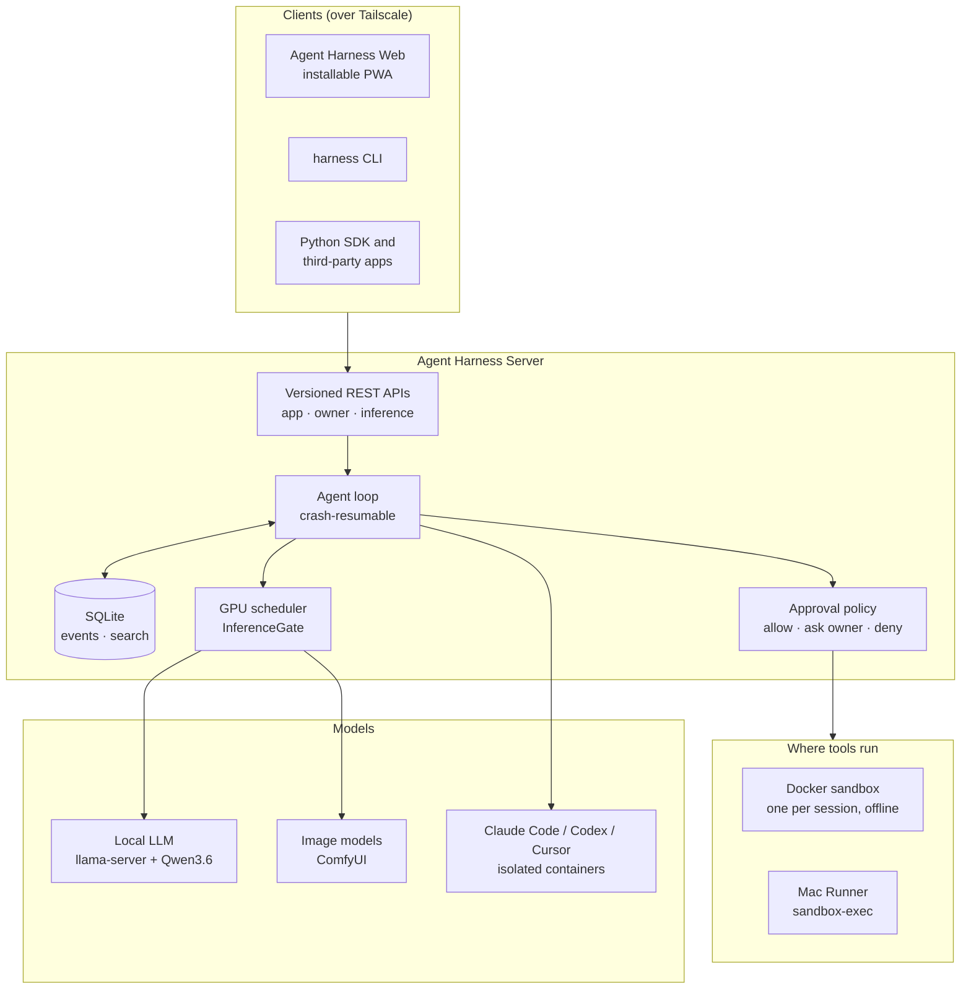
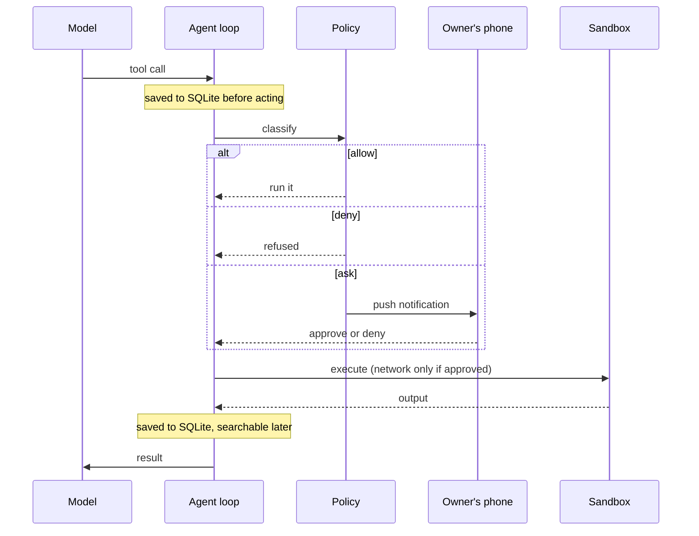
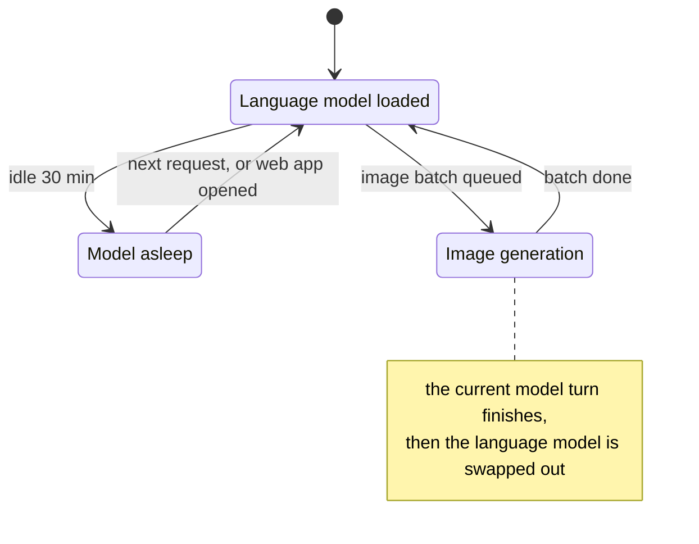
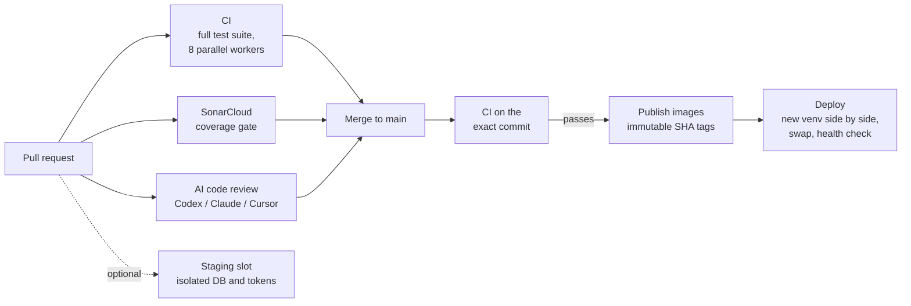

# Agent Harness

[](https://github.com/dflippojr/agent-harness/actions/workflows/ci.yml)
[](https://sonarcloud.io/summary/new_code?id=dflippojr_agent-harness)
[](https://sonarcloud.io/summary/new_code?id=dflippojr_agent-harness)

[](LICENSE)

**A self-hosted platform for running coding agents.** Agents run on a home GPU server, either against a local
open-weight model (Qwen3.6-35B-A3B on llama.cpp) or through your own Claude Code, Codex, or Cursor subscription.
You drive them from a phone or laptop over Tailscale. Every tool call runs in a sandbox, anything risky needs
your approval (a push notification lets you approve from the lock screen), and each session's work arrives as a
git branch for you to review and merge.

- **One daemon, many front ends:** an installable PWA, a CLI, a Python SDK, versioned app/owner REST APIs, and
  an OpenAI- and Anthropic-compatible inference endpoint.
- **Local and hosted backends behind one interface:** the native agent loop runs the local model, and the
  unmodified vendor CLIs run in isolated containers. Their JSONL output is translated into the same event stream.
- **One GPU, shared safely:** agent sessions, external API requests, and image generation share a single 16 GB
  card through one scheduler, which swaps the language model and image models in and out as needed.
- **Built to be measured:** the model and the agent loop were chosen with a benchmark suite graded by hidden
  tests. On that suite, this project's loop matched or beat OpenHands and OpenCode running the same local model.

| Stack | Scale | Quality gates |
| --- | --- | --- |
| Python 3.12 · FastAPI · SQLite · Docker · llama.cpp · vanilla JS PWA | ~41K lines · 870+ tests in 88 files | CI on every PR · SonarCloud coverage gate · AI code review · fail-closed deploys |

---

## Architecture



### Life of a tool call



### Sharing one GPU



### From pull request to production



---

## Repository layout

```text
agent-harness/
├── harness/               Agent Harness Server: the daemon
│   ├── runner.py          re-entrant agent loop (every step committed to SQLite before acting)
│   ├── manager.py         session create / message / approve / cancel / crash recovery
│   ├── scheduler.py       single-slot GPU queue that keeps the prompt cache warm
│   ├── policy.py          deterministic allow / ask / deny rules
│   ├── sandbox.py         per-session Docker containers, internal network only
│   ├── cli_backends.py    Claude Code / Codex / Cursor CLIs as session backends
│   ├── compaction.py      context compaction before each model call
│   ├── state.py           structured per-round agent state + reset_round
│   ├── grounding.py       checks that quoted text in answers was actually read
│   ├── verify.py          turns test/lint logs into a bounded failure list
│   ├── search_index.py    what the SQLite FTS5 session index holds (queries: harness_modules/search)
│   ├── apps.py, admin.py  versioned App API and owner API
│   ├── principal.py       owner / member / guest / app / device identity model
│   ├── settings*.py       typed configuration registry
│   ├── managed_config.py  crash-safe config overlay: pending → active → last-known-good
│   ├── images.py          ComfyUI image generation and GPU hand-off
│   ├── remote.py          runner protocol (at-least-once over long-poll)
│   └── web/               Agent Harness Web: vanilla JS PWA with a service worker
├── macrunner/             Mac Runner: stdlib-only Python 3.9, launchd, sandbox-exec profile
├── sdk/                   single-file Python SDK (depends only on httpx) + example app
├── bakeoff/               model and harness benchmarks, hidden-test tasks, recorded-web suite
├── reference/             pinned OpenHands / OpenCode images for comparison runs
├── sandbox/               sandbox and hosted-CLI Dockerfiles
├── ops/                   egress proxies, service tasks, Tailscale, deployment, review runner
├── install/               PowerShell + POSIX installers and uninstallers
├── tests/                 pytest suite + Node harnesses for the web UI's pure functions
├── docs/                  API contracts, design docs, per-phase results
└── .github/workflows/     CI, SonarCloud, AI review, staging, publish + deploy
```

### Components

| Component | What it is | Where it lives |
| --- | --- | --- |
| **Agent Harness Server** | The host daemon and its APIs | [`harness/`](harness) |
| **Agent Harness Web** | The first-party browser UI and installable PWA ([`docs/web.md`](docs/web.md)) | [`harness/web/`](harness/web) |
| **Agent Harness CLI** | The installed `harness` command | [`harness/cli.py`](harness/cli.py) |
| **Agent Harness Runner** | A remote execution worker, such as the Mac Runner | [`macrunner/`](macrunner) |
| **Agent Harness SDK** | The supported Python client library | [`sdk/`](sdk) |
| **Agent Harness App** | A third-party integration that uses the App API | [`docs/app-api.md`](docs/app-api.md) |
| **Agent Harness for Mac** | The Mac distribution that installs the CLI and the Mac Runner together | [`docs/mac-client.md`](docs/mac-client.md) |

---

## Engineering highlights

The techniques below are the ones I think are most worth a look. Each links to its code.

### Agent runtime

| Technique | What it does and why |
| --- | --- |
| **Crash-resumable agent loop** ([`runner.py`](harness/runner.py), [`db.py`](harness/db.py)) | Every step reads the session from SQLite and commits its result before the next step. After a daemon restart, a session resumes where it stopped: mid model call, waiting on an approval, or during an interrupted tool call. |
| **Compaction that never eats the answer** ([`compaction.py`](harness/compaction.py)) | Old reasoning and tool output are trimmed first, at no cost. Only if that isn't enough are older turns summarized into handoff notes, keeping the system prompt, the task, and recent turns verbatim. Compaction runs only **before** a model call, so a final answer is never summarized away (a failure seen in another harness during benchmarking). |
| **Structured state and round resets** ([`state.py`](harness/state.py)) | The agent keeps validated JSON state (goal, plan, errors, next step). `reset_round` starts a fresh context from that state plus a git-porcelain file list, instead of letting a long transcript degrade. |
| **Quote grounding** ([`grounding.py`](harness/grounding.py)) | A quoted passage of 25+ characters in a final answer must appear in something the agent actually read. Matching compares only letters and digits, so PDF spacing and Markdown don't cause false alarms. A failure gets one fix request, then a visible ⚠ flag. |
| **Summarizing verify tool** ([`verify.py`](harness/verify.py)) | Parses pytest and linter logs into a short, bounded failure list, so test output doesn't flood the context. |
| **Recorded web** ([`web_fixture.py`](harness/web_fixture.py)) | Real search results and page bytes are captured once and replayed offline, which makes web-research runs reproducible and gradable. |

### Security and isolation

| Technique | What it does and why |
| --- | --- |
| **Sandbox as the boundary, policy as a usability gate** ([`sandbox.py`](harness/sandbox.py), [`policy.py`](harness/policy.py)) | Each session gets a long-lived container on an internal network with no route out. Only an approved `network: true` command temporarily attaches an egress network. Git work that needs credentials runs host-side, where the agent can't reach it. |
| **Per-provider egress allowlists** ([`ops/egress`](ops/egress)) | Each hosted CLI runs unmodified in its own container, with its own auth volume and internal network. Its only way out is a proxy filtered to that vendor's API hosts. |
| **Principal model** ([`principal.py`](harness/principal.py), [`access.py`](harness/access.py)) | Owner, household member, time-boxed guest, app, and device identities, all keyed by opaque `user_id`. A login can hold only one role. Members get separate projects, storage roots, and quotas. |
| **Path containment** ([`storage.py`](harness/storage.py)) | Rejects symlinks, Windows junctions/reparse points, traversal, and case/Unicode tricks that would resolve outside an account's root. Quota measurement never follows links. |
| **Hardened snippet runner** ([`snippets.py`](harness/snippets.py)) | Code snippets from chat run in a digest-pinned container with no mounts, no network, and a read-only root filesystem. Compiler and program output come back on separate streams, so a program can't pass its own output off as compiler output. |
| **Phone approvals without a login** ([`notifications`](harness_modules/notifications/service.py)) | ntfy action buttons carry a per-approval secret. A decided notification is replaced in place, using the approval id as the sequence id. |

### GPU scheduling

| Technique | What it does and why |
| --- | --- |
| **Session-long GPU slot** ([`scheduler.py`](harness/scheduler.py)) | A session holds the model slot for its whole run instead of per generation, because interleaving would evict llama-server's prompt cache (a cold 29K-token prompt costs ~33 s). The slot is released while the session waits on a human or an app. |
| **InferenceGate** ([`endpoint.py`](harness/endpoint.py), [`images`](harness_modules/images/service.py)) | One lock arbitrates agent turns, external `/v1` requests (which go ahead of the next agent turn), and image jobs (which take the gate exclusively, swap the LLM out for ComfyUI, and swap it back). |
| **Tiled upscaling** ([`upscale.py`](harness_modules/images/upscale.py)) | Real-ESRGAN runs in tiles so 2×/4× upscales fit in 16 GB. Oversized outputs are refused before any memory is allocated. |
| **Predictive warm-up** ([`warmup.py`](harness_modules/local_model/warmup.py)) | Selecting the local model checks `/props` for a sleeping model (without waking it) and warms it, so the model is usually loaded before the task is typed. |

### Clients and remote execution

| Technique | What it does and why |
| --- | --- |
| **Long-poll runner protocol** ([`service.py`](harness_modules/runners/service.py), [`harness_runner.py`](macrunner/harness_runner.py)) | The Mac connects out and long-polls, so it needs no inbound port and no dependencies (stock Python 3.9). Delivery is at-least-once: re-sent requests are answered from the runner's result cache, and a restarted runner fails the work it can't vouch for. |
| **Native macOS sandboxing** ([`sandbox.sb`](macrunner/sandbox.sb)) | Shell commands run under `sandbox-exec`: writes limited to the workspace and build caches, credentials and personal folders unreadable, no network unless approved. |
| **Protocol-versioned clients** ([`compat.py`](harness/compat.py), [docs](docs/compatibility.md)) | Wire protocols are versioned separately from releases. The server accepts current and previous versions. Skew returns `426 client_update_required` or `426 daemon_update_required` while health and update discovery stay reachable. |
| **Transactional self-update** ([`updater.py`](harness/updater.py)) | The Mac client downloads only from its own server, verifies size and SHA-256, swaps the runtime atomically, keeps credentials and config, and rolls back on failure. |
| **No-build PWA on public contracts** ([`harness/web`](harness/web)) | The web UI is vanilla JS with a service worker. It uses the same `/api/v1` and `/api/admin/v1` contracts offered to third-party apps, and authenticated SSE, images, and downloads never put bearer tokens in URLs. |

### Configuration and data

| Technique | What it does and why |
| --- | --- |
| **Typed configuration registry** ([`settings.py`](harness/settings.py), [docs](docs/config-registry.md)) | Every writable setting has an explicit spec with a named setter: no reflection, no dotted-path traversal, no YAML merge. Writes use optimistic concurrency (revision + ETag → `409`), batches are all-or-nothing, and a failed apply hook undoes the hooks already applied. |
| **Crash-safe config lifecycle** ([`managed_config.py`](harness/managed_config.py), [`overlay.py`](harness/overlay.py)) | An explicit state machine covers the active, pending (restart-required), last-known-good, and quarantined generations, using fsync plus atomic replace. Boot applies only confirmed config. |
| **Search on write** ([`search`](harness_modules/search/service.py)) | Every persisted event is indexed into SQLite FTS5 as it's written. Agents can search and read past sessions through `session_search` / `session_read`. |
| **Stale-aware review comments** ([`review_comments.py`](harness/review_comments.py)) | Line comments on a diff are anchored to side, range, and base/head commits. A comment whose quoted lines have since changed is marked stale when sent back to the agent. |

### Testing and delivery

| Technique | What it does and why |
| --- | --- |
| **Self-validating benchmarks** ([`bakeoff/`](bakeoff)) | Each task ships with a reference solution. `--selftest` proves every checker passes on correct work and fails on no work. The hard suite grades mostly with hidden tests, and `rescore` regrades saved runs after a checker fix. |
| **Isolated comparison harnesses** ([`reference.py`](bakeoff/reference.py)) | OpenHands and OpenCode run the same tasks on an internal Docker network whose only route out is a socat proxy to the local model. |
| **One suite for everything** ([`tests/`](tests)) | The web UI's JavaScript runs under Node harnesses driven by pytest. The CI and deploy workflows, the installers, and the docs' product naming have their own tests too. |
| **Fail-closed deployment** ([`ci-cd.yml`](.github/workflows/ci-cd.yml), [docs](docs/CI-CD.md)) | Deployment triggers from `workflow_run` on the exact tested SHA and pulls immutable `sha-` images. It builds a new venv side by side and switches a pointer, so rollback is instant, then waits for `/health`. |
| **Trusted-code staging slot** ([`resolve_staging_ref.py`](scripts/resolve_staging_ref.py)) | A GitHub-hosted job resolves a branch or PR to one commit and rejects fork refs before anything reaches the server. Staging gets its own database and freshly minted tokens, never production credentials. |
| **Multi-provider AI code review** ([`review.yml`](.github/workflows/review.yml)) | Pull requests are reviewed by Codex, Claude, or Cursor on a self-hosted runner pool, with incremental re-review when a prior review marker makes that safe. The `Automated Code Review` check fails when the review has findings, and other projects call the same workflow through a thin caller pinned to `review-v1`. |

---

## Benchmark results

Model and harness choices were measured, not guessed. All runs used an RTX 4070 Ti Super (16 GB), llama.cpp, and
a 32K context. Every failure was checked by hand ([full results](docs/phase0-results.md)).

**Choosing the model.** The core suite has 13 tasks and the hard suite has 10, most graded by hidden tests. Each
task ran twice.

| Model | Core suite | Hard suite | Decode tok/s | Decision |
| --- | --- | --- | --- | --- |
| **Qwen3.6-35B-A3B** (MoE, experts partly in RAM) | **26/26** | **19/20** | ~70 | Default agent model |
| gpt-oss-20b | 23/26 | 16/20 | ~160 | Fast secondary model |

Devstral-Small-2 24B was also tried and dropped: as a dense 24B model it doesn't fit in 16 GB at 32K context.

**Comparing harnesses.** This project's loop and two established open-source harnesses ran the same hard suite
with the same local Qwen model:

| Harness | Pass | Avg time per task |
| --- | --- | --- |
| **This project's loop** | **19/20** | **47 s** |
| OpenCode 1.18.30 | 18/20 | 81 s |
| OpenHands CLI 1.16.0 | 18/20 | 126 s |

---

## Install

The **full** profile runs on Windows 10/11 or x86-64 Linux and needs an NVIDIA GPU with 12 GB+. The **service**
profile (hosted providers only, no GPU) also runs on Apple Silicon macOS. Every platform needs Docker and Git.
No admin rights are needed.

```powershell
# Windows — full profile (local model + everything)
git clone https://github.com/dflippojr/agent-harness; cd agent-harness
powershell -ExecutionPolicy Bypass -File install\install.ps1

# Windows — hosted-provider service profile
powershell -ExecutionPolicy Bypass -File install\install.ps1 -Profile Service
ops\backends\login.ps1 codex        # or claude / cursor
```

```bash
# Linux (defaults to full) or Apple Silicon macOS (defaults to service)
install/install.sh
ops/backends/login.sh codex         # or claude / cursor
```

Diagnose an install with `python -m harness.doctor`. The full guide is [`docs/INSTALL.md`](docs/INSTALL.md).

### Quick start (development)

```powershell
python -m venv .venv; .\.venv\Scripts\pip install -r requirements.txt
.\.venv\Scripts\python -m harness                  # daemon on 127.0.0.1:8100
.\.venv\Scripts\python -m harness.cli new "Clone local:invoice-tools, fix the failing test, and report back"
.\.venv\Scripts\python -m pytest tests -q -n 8 --dist loadfile
```

### Driving it from code

```python
from harness_client import Harness, tool

@tool("Add an item to the shopping list", item={"type": "string"})
def add_item(item: str) -> str:
    shopping.append(item)
    return f"added {item}"

h = Harness("https://tower.your-tailnet.ts.net", token="ha-...")
result = h.run("Plan dinner for four and add what I need to the list",
               context={"Pantry": "rice, eggs, olive oil"}, tools=[add_item])
print(result.answer)
```

App-registered tools are called like built-in tools. While the agent waits for your app to answer, the session
gives up the GPU.

---

## Documentation

| Topic | Doc |
| --- | --- |
| Installation and profiles | [INSTALL](docs/INSTALL.md) · [service profile](docs/service-profile.md) |
| App API and SDK | [app-api](docs/app-api.md) · [`sdk/`](sdk) |
| Owner API, members, per-app provider keys | [admin-api](docs/admin-api.md) |
| Configuration registry | [config-registry](docs/config-registry.md) |
| Web client deployment | [web](docs/web.md) |
| Mac client and version compatibility | [mac-client](docs/mac-client.md) · [compatibility](docs/compatibility.md) |
| CI/CD and trust boundaries | [CI-CD](docs/CI-CD.md) |

<details>
<summary><b>Build history</b>: the project was built in phases, each with a written results doc</summary>

| Phase | Scope | Results |
| --- | --- | --- |
| 0 | Model bake-off: local models, task suites, reference harnesses | [phase0](docs/phase0-results.md) |
| 1 | Daemon: re-entrant loop, per-session sandbox, SSE, approvals | [phase1](docs/phase1-results.md) |
| 2 | Phone control surface: PWA, ntfy, Tailscale | [phase2](docs/phase2-results.md) |
| 3 | Git-backed projects, branch-per-session review, homelab tools | [phase3](docs/phase3-results.md) |
| 4 | MacBook as a remote execution target | [phase4](docs/phase4-results.md) |
| 5 | Metrics, backups, read-only memory library | [phase5](docs/phase5-results.md) |
| 6 | Web search, inference endpoint, image generation, App API | [6a](docs/phase6a-hermes-study.md) · [6b](docs/phase6b-results.md) · [6c](docs/phase6c-results.md) · [6d](docs/phase6d-results.md) · [6e](docs/phase6e-results.md) |
| 7 | Session search, memory writes, scheduled jobs, recorded web | [7a](docs/phase7a-results.md) · [7b](docs/phase7b-results.md) · [7d](docs/phase7d-results.md) · [7e](docs/phase7e-results.md) |
| 8 | Hosted subscription backends, Claude Remote Control, quote checks | [8a](docs/phase8a-design.md) · [8b](docs/phase8b-results.md) · [8c](docs/phase8c-results.md) |

</details>

## License

[MIT](LICENSE) © 2026 Daniel Flippo
